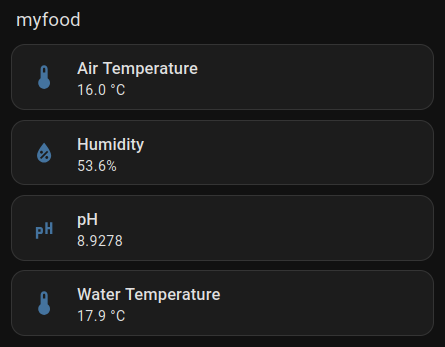

# myfood-cloudless

Run your [myfood](https://myfood.eu) greenhouse controller **cloudless**: have the
controller push its sensor readings onto your LAN over **MQTT** so Home Assistant (or
anything else) reads them locally — no dependence on myfood's cloud for your own data —
plus notes on **securing** the controller. Targets **App Core v0.6.0**.

You keep myfood's cloud working alongside this (for remote access / their web UI / their
support), but you no longer *depend* on it for your own data.

## What's here

- **[CLOUDLESS.md](CLOUDLESS.md)** — the full guide and a maintained factory-image mod log:
  enabling the controller's local MQTT broker, 5-minute cadence, the RTC/clock gotcha,
  re-pointing the cloud after a firmware update, **security hardening**, the Home Assistant
  **Mosquitto bridge**, and the MQTT sensors. Includes a **post-update checklist**, since a
  myfood security update reflashes the SD card and wipes every change.
- **[examples/homeassistant-mqtt.yaml](examples/homeassistant-mqtt.yaml)** — the four Home
  Assistant MQTT sensors (pH, water temperature, air temperature, humidity).

## How it works, in one paragraph

The controller ("myfood App Core") runs an embedded MQTT broker. You enable it in
`user.json` (the dashboard toggle doesn't persist on v6), point it at a local topic, and it
publishes a JSON reading every measure cycle. A Mosquitto bridge on Home Assistant pulls
that topic into HA's broker, and four MQTT sensors turn it into entities — exact timestamps,
whatever cadence you set, no cloud round-trip.

## Why cloudless

- **Your data stays local** and keeps working even if myfood's servers or your internet are down.
- **Nothing sensitive stored** — no cloud token living in Home Assistant.
- The cloud stays available for what it's actually good at (remote access, the web UI, support).

## Requirements

- A myfood controller on **App Core v0.6.0** with SSH access (the guide covers adding a key
  offline via the SD card).
- Home Assistant with the **Mosquitto broker** add-on.

## The old Blazor scraper

Earlier versions of this repo shipped a credential-free **Blazor scraper** plus a Home
Assistant custom integration that read the controller's rendered dashboard directly over its
SignalR circuit — handy on **v0.3.2.0**, where it needed no SSH. It does **not** work on
v0.6.0 (the dashboard renders placeholder zeros first and only fills the real values in a
later render a headless client doesn't trigger), so it has been removed in favour of the
MQTT path. It remains in this repo's **git history** if you're on older firmware and want it.

## Disclaimer

Not affiliated with or endorsed by myfood. The local setup was worked out by observing the
owner's own device; use on equipment you own. This guide deliberately omits default
credentials and unit identifiers — if you're looking at the wider fleet rather than your own
unit, the responsible path is coordinated disclosure to myfood.

## License

MIT © Om Cular. See [LICENSE](LICENSE).
